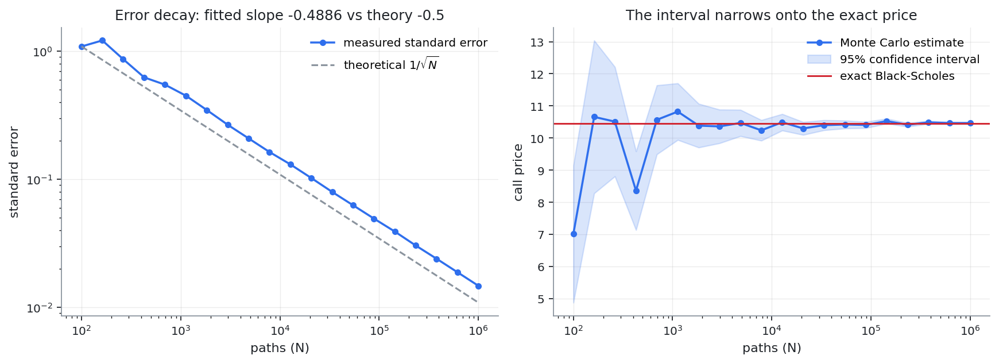
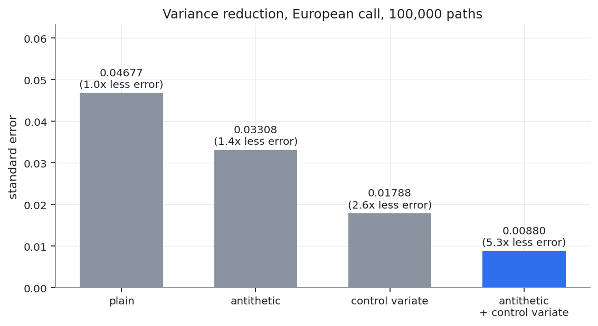
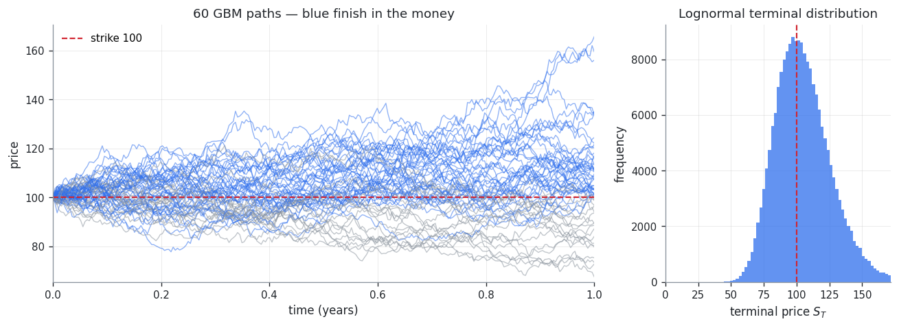

# Monte Carlo Option Pricing

**A derivatives pricing engine that reports what most Monte Carlo implementations leave out: how much of the answer is noise.**

[](https://github.com/YOUR-USERNAME/monte-carlo-option-pricing/actions/workflows/tests.yml)
[](https://www.python.org)
[](LICENSE)
[](https://github.com/astral-sh/ruff)

Every price this library returns carries a standard error and a confidence
interval. Variance reduction is measured rather than asserted. The
$1/\sqrt{N}$ convergence rate is recovered from the code's own output rather
than quoted from a textbook.

**[Live demo](https://YOUR-APP.streamlit.app)** · **[Methodology](docs/METHODOLOGY.md)**

---

## The premise

European calls and puts have a closed-form solution — that is what
Black-Scholes *is*. Using Monte Carlo to approximate a number you can compute
exactly demonstrates nothing about Monte Carlo.

It does, however, make an excellent **correctness test**: if the exact price
does not fall inside the simulation's confidence interval, the engine is wrong.
That is how European options are used here.

The method earns its keep on the **arithmetic Asian** and **barrier** payoffs,
which have no closed form at all — and where a control variate built from a
related solvable problem cuts the error by more than an order of magnitude.

---

## Results

Every figure below is regenerated by `python benchmark.py` and
`python scripts/make_figures.py`. Nothing is quoted that the repository cannot
reproduce.

### Convergence



Fitted log-log slope of standard error against path count: **-0.4886**, against
a theoretical **-0.5**. This is the method's central limitation — an extra
decimal place of accuracy costs a hundred times the work — and the reason
variance reduction matters so much.

### Variance reduction



European call, $S_0 = K = 100$, $r = 5\%$, $\sigma = 20\%$, $T = 1$, 100,000 paths.
Exact Black-Scholes price **10.450584**.

| Method | Price | Std error | Error cut | Equivalent path saving |
|---|---:|---:|---:|---:|
| plain | 10.4205 | 0.04677 | 1.0x | 1x |
| antithetic | 10.4673 | 0.03308 | 1.4x | 2x |
| control variate | 10.4668 | 0.01788 | 2.6x | 7x |
| **antithetic + control variate** | **10.4409** | **0.00880** | **5.3x** | **28x** |

Since error falls as $1/\sqrt{N}$, cutting the standard error by 5.3x is worth
28x the paths.

### Arithmetic Asian — where Monte Carlo is actually necessary

52 fixings, 50,000 paths.

| Method | Price | Std error | Error cut |
|---|---:|---:|---:|
| plain | 5.8132 | 0.03603 | 1.0x |
| **antithetic + control variate** | **5.8534** | **0.00105** | **34.5x** |

The control variate is the **geometric** Asian option, which has a closed form
because the geometric mean of lognormals is itself lognormal. It correlates with
the arithmetic version at roughly 0.999 — a 34.5x error reduction, equivalent to
about 1,200x the path count. [Derivation](docs/METHODOLOGY.md#6-the-geometric-asian-closed-form)

### Greeks

Finite differences with common random numbers, 200,000 paths.

| Greek | Monte Carlo | Analytic | Absolute difference |
|---|---:|---:|---:|
| delta | 0.63646 | 0.63683 | 3.7e-04 |
| gamma | 0.01876 | 0.01876 | 6.9e-06 |
| vega | 37.54999 | 37.52403 | 2.6e-02 |
| rho | 53.20276 | 53.23248 | 3.0e-02 |

Bumped valuations reuse the same random draws. Without that, the difference of
two independently-noisy prices is dominated by noise and the estimator variance
scales as $O(h^{-2})$ — unusable at any practical path count.

### Simulated dynamics



---

## Quick start

```bash
git clone https://github.com/YOUR-USERNAME/monte-carlo-option-pricing.git
cd monte-carlo-option-pricing

python3 -m venv .venv
source .venv/bin/activate          # Windows: .venv\Scripts\activate
pip install -e ".[app,dev]"
```

Then:

```bash
streamlit run app.py               # interactive app
python benchmark.py                # reproduce every table above
pytest                             # 27 tests
```

Or via `make`:

```bash
make install    # venv + all dependencies
make app        # launch the app
make bench      # print the tables
make test       # run the tests
make figures    # regenerate README figures
```

### Library use

```python
from mcopt import price_european, price_asian, black_scholes_price

est = price_european(S0=100, K=100, r=0.05, sigma=0.2, T=1.0,
                     n_paths=200_000, seed=42)

print(est)                 # 10.4388 +/- 0.0062 (95% CI [10.4266, 10.4510], ...)
print(est.ci95)            # (10.4266, 10.4510)
print(est.sigmas_from(black_scholes_price(100, 100, 0.05, 0.2, 1.0)))   # 1.89

# No closed form exists for this one.
asian = price_asian(S0=100, K=100, r=0.05, sigma=0.2, T=1.0,
                    n_fixings=52, n_paths=100_000, seed=7)
```

---

## What is implemented

| Instrument | Payoff | Pricing | Variance reduction |
|---|---|---|---|
| European call/put | $\max(S_T - K, 0)$ | Monte Carlo + exact Black-Scholes | antithetic, control variate |
| Arithmetic Asian | $\max(\bar{S} - K, 0)$ | Monte Carlo only | antithetic, geometric-Asian control |
| Geometric Asian | $\max(G - K, 0)$ | closed form | — |
| Up-and-out barrier | knock-out call | Monte Carlo only | antithetic |
| Greeks | delta, gamma, vega, rho | finite difference + analytic | common random numbers |

---

## Project structure

```
mcopt/
  analytic.py       closed-form prices, Greeks, geometric-Asian formula
  engine.py         sampling, pricers, standard errors, variance reduction
  convergence.py    convergence study and slope fitting
app.py              Streamlit interface
benchmark.py        reproduces every number in this README
scripts/
  make_figures.py   regenerates the figures above
tests/
  test_pricing.py   27 tests
docs/
  METHODOLOGY.md    derivations for every technique used
```

The pricing library has no knowledge of how it is being called — the terminal
script, the web app and the test suite are three front ends over the same code.

---

## Tests

```bash
pytest
```

27 tests, run on Python 3.10-3.13 in CI. The ones that matter assert behaviour
rather than absence of crashes:

- Monte Carlo lands within 4 standard errors of the exact Black-Scholes price
- the 95% confidence interval brackets the true value
- antithetic sampling measurably reduces the standard error
- the control variate reduces it by more than half
- the **geometric-Asian closed form is verified against an independent Monte
  Carlo of the same payoff** — the formula used as a control variate is itself
  tested rather than trusted
- the arithmetic Asian exceeds the geometric Asian (AM >= GM)
- an unreachable barrier recovers the vanilla price
- finite-difference Greeks match the analytic ones
- the fitted convergence slope is -0.5 +/- 0.06
- the same seed reproduces the same answer; a different seed does not
- degenerate inputs ($T = 0$, $\sigma = 0$) return intrinsic value instead of
  dividing by zero

---

## Design decisions

**European payoffs never build a path grid.** Only $S_T$ matters, so only $S_T$
is drawn — one normal per path instead of 252. This is exact rather than
approximate: the GBM solution is known in closed form, so there is no
discretisation error being traded away.

**Antithetic standard errors are computed on pair averages.** Antithetic draws
are negatively correlated by construction; `std(all_samples)/sqrt(n)` would
misstate the error. [Why](docs/METHODOLOGY.md#the-trap)

**Everything is seeded.** `np.random.default_rng(seed)` throughout, no legacy
global state. Two runs with the same seed are bit-identical.

---

## Limitations

Stated plainly, because a project that overclaims is worse than one with a short
feature list.

- **Geometric Brownian motion only** — constant volatility, no smile, no jumps,
  no stochastic volatility. Real markets are none of these things.
- **No American or Bermudan exercise.** That requires Longstaff-Schwartz
  least-squares Monte Carlo.
- **Barrier options are monitored discretely**, so knock-outs are systematically
  overpriced. The Broadie-Glasserman-Kou continuity correction is documented but
  not implemented.
- **The control-variate coefficient is estimated in-sample**, an $O(1/N)$ bias.
- **No calibration to market data.** Parameters are inputs, not fitted.
- **Pseudo-random sampling only.** Quasi-Monte Carlo (Sobol) would improve the
  convergence rate itself rather than only the constant.

---

## License

MIT — see [LICENSE](LICENSE).
